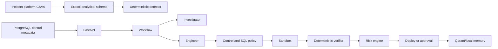

# Architecture

Agents propose. The control layer authorizes. The executor executes. The verifier proves.
The current demo uses deterministic Investigator/Engineer behavior and local JSON fallback so it works without an LLM or Qdrant; `ExasolAdapter` and the PostgreSQL schema are production integration boundaries.
