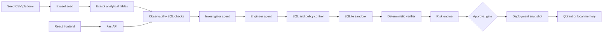

# Closed-Loop Autonomous Data Incident Agent

An autonomous data-reliability platform for detecting, investigating, repairing, verifying, and safely deploying fixes for analytical data incidents.

The workflow is:

`DETECT -> INVESTIGATE -> FIX -> CONTROL -> SIMULATE -> VERIFY -> RISK -> APPROVE -> DEPLOY -> LEARN`

The system is designed for a marks/demo environment: every proposed mutation passes deterministic policy checks and an isolated sandbox before deployment. An LLM can improve the investigation and fix proposal text, but it never authorizes production changes.

## What We Built

- FastAPI backend exposing incident, scenario, observability, approval, deployment, and rollback endpoints.
- React/Vite operations console for incidents, scenarios, observability checks, agent output, risk, approvals, and audit timeline.
- Investigator agent for root-cause analysis and similar-incident lookup.
- Engineer agent for reversible SQL or pipeline fix proposals.
- Optional OpenAI-compatible provider, including Hugging Face Inference API models.
- Deterministic SQL validator and deployment policy engine.
- SQLite sandbox for isolated fix simulation.
- Deterministic verifier, risk engine, deployment snapshot, and rollback flow.
- Exasol adapter and Exasol-backed observability implementation.
- PostgreSQL mirror for operational metadata when available.
- Qdrant memory with local JSON fallback.

## Architecture



### Data responsibilities

- **Exasol**: analytical data, quality checks, row counts, null rates, duplicates, and referential-integrity evidence.
- **PostgreSQL**: optional operational mirror for incidents, fixes, approvals, deployment records, risk, audit, lineage, and pipeline metadata.
- **SQLite sandbox**: isolated simulation of proposed mutations. It is not production data.
- **Qdrant/local JSON**: similar-incident memory and learning records.
- **CSV source dataset**: clean seed data and deterministic failure-scenario definitions.

## Project Structure

```text
app/
	agents/              Investigator, engineer, verifier, LLM provider
	config/              Environment and runtime configuration
	control.py           SQL validator and approval policy
	db/                  Exasol and PostgreSQL adapters
	deployment/          Deployment snapshot and rollback controller
	observability/       CSV and Exasol observability implementations
	repositories/        Local and PostgreSQL incident persistence
	risk/                Risk scoring
	schemas/             Pydantic incident contracts
	services/            Incident orchestrator
	simulation/          SQLite sandbox
frontend/src/          React operational console
scripts/               Exasol, PostgreSQL, and memory seed commands
tests/                 Backend workflow and policy tests
```

## Configuration

Copy the example configuration and edit it locally:

```bash
cp .env.example .env
```

Important settings:

```dotenv
EXASOL_HOST=127.0.0.1
EXASOL_PORT=8563
EXASOL_USER=sys
EXASOL_PASSWORD=<local-exasol-password>
EXASOL_ENCRYPTION=True
OBSERVABILITY_BACKEND=exasol
LLM_PROVIDER=external
OPENAI_BASE_URL=https://api-inference.huggingface.co/v1
OPENAI_MODEL=mistralai/Mistral-7B-Instruct-v0.3
```

`LLM_PROVIDER=external` enables the configured OpenAI-compatible provider. Use `LLM_PROVIDER=mock` or `deterministic` for offline execution. Never commit `.env` or expose API keys in source control, screenshots, documentation, or chat.

The HF token is used only for the external LLM provider. Local Qdrant does not require an HF token; leave `QDRANT_API_KEY` empty unless Qdrant is configured with its own authentication.

## Install and Run

### Backend dependencies

```bash
cd /Users/admin/Desktop/exasol
python -m pip install -r requirements.txt
```

### Start operational services

```bash
docker compose up -d postgres qdrant
```

### Seed Exasol Personal

Exasol Personal must be running and accepting connections on `127.0.0.1:8563`.

```bash
cd /Users/admin/Desktop/exasol
PYTHONPATH=. python scripts/seed_exasol.py
```

The script loads the CSV analytical tables into the `INCIDENT_ANALYTICS` schema. It loads customers, products, orders, order items, payments, shipments, business metrics, and quality metrics.

On macOS, Exasol Personal uses a VM. If port `8563` is open but connections reset, enable Local Network access for Terminal, VS Code, and Exasol Personal under **System Settings -> Privacy & Security -> Local Network**, then restart Exasol Personal. A successful TCP listener alone does not prove the database guest is reachable.

### Seed other stores

```bash
python scripts/seed_postgres.py
python scripts/seed_memory.py
```

### Start the backend

```bash
PYTHONPATH=. uvicorn app.main:app --host 127.0.0.1 --port 8000 --reload
```

API documentation: http://127.0.0.1:8000/docs

### Start the frontend

In a second terminal:

```bash
cd /Users/admin/Desktop/exasol/frontend
npm install
npm run dev -- --host 127.0.0.1
```

Frontend: http://127.0.0.1:5173

## Agent Workflow

1. A scenario is injected or an incident is created.
2. Observability gathers evidence from Exasol when `OBSERVABILITY_BACKEND=exasol`.
3. The investigator determines a root cause and searches incident memory.
4. The engineer creates a minimal, reversible fix proposal.
5. The SQL validator rejects forbidden DDL, comments, multi-statement SQL, unapproved tables, and unsafe mutations.
6. The SQLite sandbox simulates the fix and records before/after metrics.
7. The verifier evaluates deterministic checks and cannot convert a failure into a pass.
8. The risk engine scores blast radius, affected data, and scenario policy.
9. High-risk or critical changes wait for human approval.
10. Deployment creates a snapshot and records rollback availability.
11. The post-deployment verifier checks the result, then memory stores the successful outcome.

The LLM provider is advisory. If the external provider is unavailable, the agents use deterministic scenario logic so the safety workflow remains executable.

## API Examples

```bash
# Health and active data/agent configuration
curl http://127.0.0.1:8000/health

# List available scenarios
curl http://127.0.0.1:8000/scenarios

# Inject a schema-change incident
curl -X POST http://127.0.0.1:8000/scenarios/SCN-02/inject

# Run an incident after replacing INCIDENT_ID
curl -X POST http://127.0.0.1:8000/incidents/INCIDENT_ID/run

# Approve a high-risk incident
curl -X POST http://127.0.0.1:8000/incidents/INCIDENT_ID/approve \
	-H 'Content-Type: application/json' \
	-d '{"reviewer":"Data Reliability Lead","decision":"APPROVE","reason":"Sandbox verification passed"}'
```

Useful endpoints:

- `GET /health`
- `GET /observability/report`
- `GET /scenarios`
- `POST /scenarios/{scenario_id}/inject`
- `GET /incidents`
- `GET /incidents/{incident_id}`
- `POST /incidents/{incident_id}/investigate`
- `POST /incidents/{incident_id}/remediate`
- `POST /incidents/{incident_id}/simulate`
- `POST /incidents/{incident_id}/verify`
- `POST /incidents/{incident_id}/run`
- `POST /incidents/{incident_id}/approve`
- `POST /incidents/{incident_id}/rollback`
- `GET /incidents/{incident_id}/timeline`

## Demonstrations

Run the deterministic end-to-end demo:

```bash
PYTHONPATH=. python -m app.demo
```

The strongest demonstrations are:

- **SCN-02**: schema mismatch, high-risk approval, deployment, and rollback availability.
- **SCN-03**: null anomaly, deterministic repair, verification, and automatic resolution.

All ten scenario definitions are supported by the scenario catalog.

## Tests and Quality Checks

```bash
PYTHONPATH=. pytest -q
python -m compileall -q app scripts
cd frontend && npm run build
```

The backend test suite covers SQL policy rules, approval behavior, rollback availability, and successful deterministic workflows. The frontend build validates TypeScript and Vite compilation.

## Current Operational Notes

- Exasol observability is implemented and selected by `OBSERVABILITY_BACKEND=exasol`.
- If Exasol Personal is unavailable, `/observability/report` returns `503` rather than silently claiming that Exasol evidence was collected.
- The current demo can still be run directly with `IncidentOrchestrator` and CSV fixtures for offline tests.
- External Hugging Face calls require working DNS/network access to `api-inference.huggingface.co`.
- Qdrant version compatibility should be kept aligned between the Python client and the local server image.

## Reference Files

- [Architecture](ARCHITECTURE.md)
- [API reference](API.md)
- [Frontend README](frontend/README.md)
- [Makefile](Makefile)
- [Environment template](.env.example)

## Shared Project Materials

https://drive.google.com/drive/folders/1ivrERIFjZ3FDGuK4BwCrDFWRNaPxxR0e?usp=sharing
